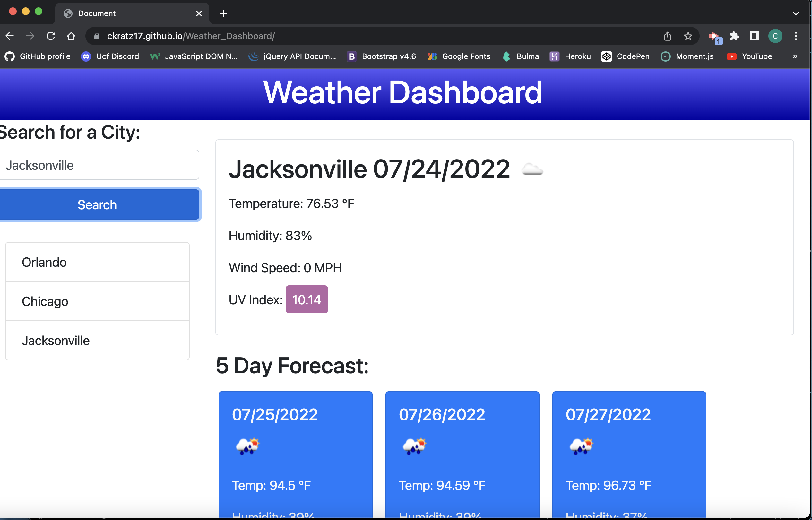

# Weather Dashboard

    ##Table of Contents
   
[Description](#description)
    
[Installation](#installation)
    
[Usage](#usage)
    
[License](#license)
    
[Contributing](#contributing)
    
[Testing](#testing)
    
[Questions](#questions)
    
## Description
    
A web application that shows the current weather and five day forecast for a searched city.
    
## Installation
    
n/a
    
## Usage
    
Search for a city in the input bar and click the search button to pull up the current weather, alongside the five day forecast for the city searched. The searched city will then appear under the search bar and if clicked, will pull up its information.
    
## License
    
MIT
    
## Contributing
    
n/a

## Testing

n/a

## Questions

(https://github.com/ckratz17)

ckratz17@gmail.com